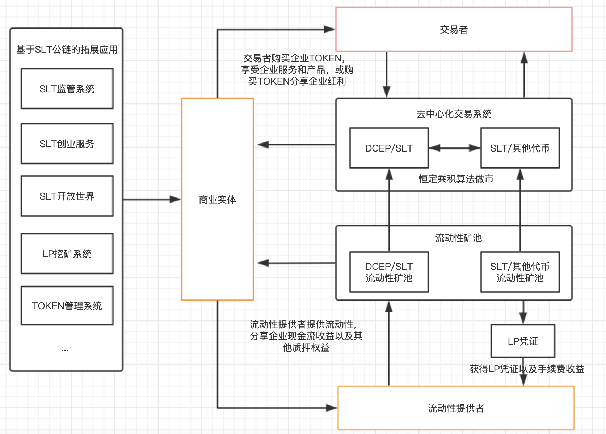
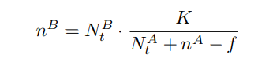
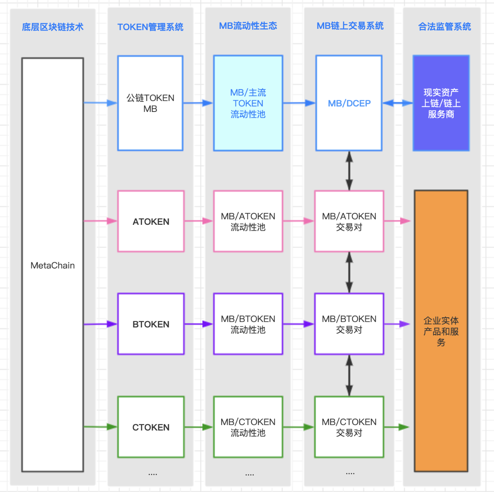
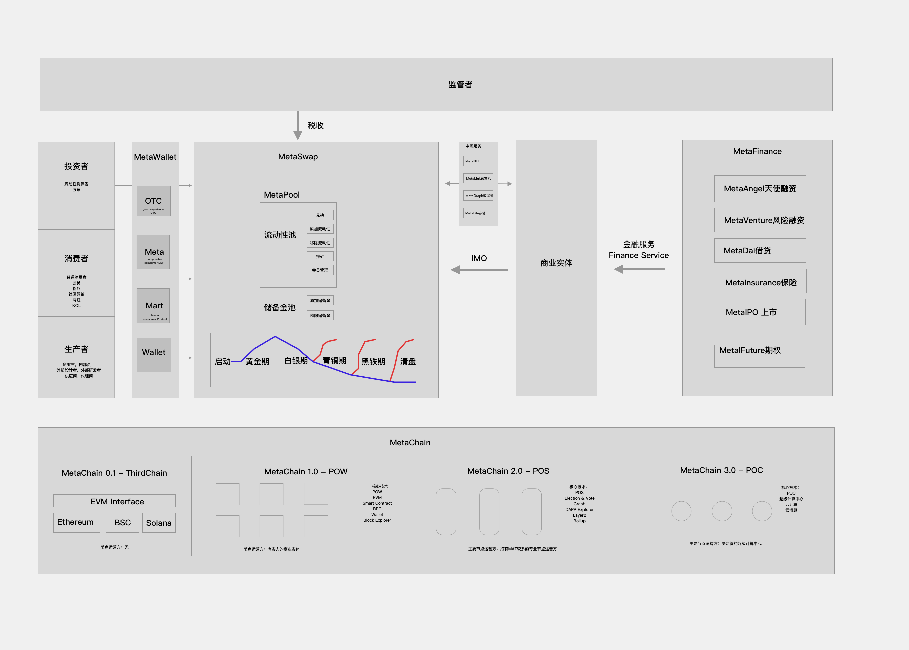

MetaMart whitepaper
==============
猛码：为商业实体提供区块链金融服务
==========

# 前言
```
权益重新分配与自组织效率优化是一场必然的革命。  
Hewhoreceivesanideafrommetreceivesinstructionhimselfwithoutlesseningmine;ashewholightshistaperatmine，receiveslightwithoutdarkeningme.  

我将思想传授他人，他人之所得，无损于我之所有，犹如一人以我之烛火点烛，光亮与他同在，我亦不因此身处黑暗。  
《致艾萨克•麦弗逊的信》托马斯•杰斐逊  
```

随着区块链技术的诞生，货币作为股权和债权的最终表现形式发生了革命性的改变一一通证，代表着未来数字化资产的货币横空出世，划时代的数据化特性和分布式存储技术，使得持有者天然成为商业体的股东。可惜的是，区块链技术日益突飞猛进，但当下的区块链经济体系仍处于早期探索阶段，使得SLT 明明知晓身后除了进步别无他物，却仍以为眼前只剩逐利。尽管如此SLT 依然相信，基于共识的权益分配方式带来自组织效率优化，作为区块链经济体系的思想基石，将输出并影响到千行百业，是一场必然的革命。  

#    一、 行业前景分析
## 1.1、行业简述

根据《年度区块链产业发展报告（2020）》中指出，我国区块链产业蓬勃发展，企业数量不断增加，应用落地多点开花，涵盖了包括贸易物流、文娱、社会公共服务、金融、政务、知识产权、社交、日常消费、工业、农业、能源等多个垂直行业，根据公开数据统计，2020年，我国2020年总共落地区块链项目数达194个，同比增加102.8%。各地纷纷布局区块链新基建，基础设施不断完善，行业生态不断健全，若从全年融资轮次整体分布情况看，区块链仍处于发展早期阶段，投融资以初期轮次为主，机构对其虽有看好，但仍在观望阶段。战略投资仍旧占据主导地位，全年共有战略投资229起，占总融资数量的50%，种子/天使轮融资以101起次之，A轮融资占比在8月后有逐步增加。
2021年是区块链快速发展之年，随着BTC突破60000美金，未来这个行业将得到越来越多的关注。

## 1.2 政策支持
在近期的十四五规划中，区块链首次被纳入国家五年规划，成为发展数字经济和建设数字中国的重要载体，这标志着区块链技术的集成应用将在数字产业化和产业数字化过程中发挥愈发关键的作用，并将促进数字技术与实体经济深度融合，赋能传统产业转型升级，催生新产业新业态新模式，壮大经济发展新引擎。
“十四五”将是数字经济大发展大繁荣的五年，也会是区块链创新加速、构建生态、广泛落地、纳入监管的五年。《十四五规划纲要》明确了技术创新、平台创新、应用创新、监管创新这四大区块链创新方向，将进一步加快数字中国的建设步伐，助推社会主义现代化建设。
在2015年，国务院颁布了关于《积极推进“互联网+”行动的指导意见》，中国在随后5年那互联网+发展迅猛，以淘宝，美团，嘀嘀打车为首的各大互联网巨头相续涌出，通过互联网大大赋能了实体产业，提升了传统企业的效率，降低用户衣食住行的时间成本，但同时也瓜分了传统企业的利润，借助帮助传统企业进行互联网转型的理由，实则对传统企业进行或多或少的剥削，这也是在这些互联网企业形成一定规模并“垄断”后，用户的消费成本迅速增加，在目前互联网+的转型遇到瓶颈期后，传统企业急需能够进行转型的利器。

## 1.3 目前区块链行业存在的问题
### 1.3.1思维局限
如果回到20年前，马云和你说互联网+的时候，你也可能像很多企业一样很茫然，因为当时没有一个可以参考的样本，突然的互联网转型，使得实体行业忿然拒绝也是常理之中。如同当下的区块链+。互联网的出现大大缩短了用户的时间成本，但是开车的还是开车的，卖黄瓜的还是卖黄瓜，只是换了一种方式做生意，其本质没有改变，互联网+是通过整合资源达到的效率最大化，而区块链+是解决信任问题达到效率最大化。MetaMart习惯于信任政府，信任大公司，但现实中很多小事是因为信任问题没有解决而导致效率低下。

### 1.3.2 实体结合困难

很多企业进行区块链结合的时候，没有去仔细想过区块链到底带来了什么，盲目的发币，发链等，这些都没有挖掘区块链的最大价值，MetaMart也称之为落地困难。基于这种思路是无法让区块链的功能和作用得到发挥的。这同样是区块链的发展之所以会如此缓慢的主要原因。事实上，在区块链时代，MetaMart更多地需要关注的是关注个体。特别是要关注个体之间对接方式和改变以及基于个体的新的信任机制的建立。当MetaMart真正关注个体的时候，特别是当MetaMart真正离开中心，能够建立起个体与个体之间的信任机制的时候，一种全新的商业运行逻辑，才算是真正形成。

### 1.3.3 旁氏骗局让很多人对区块链望而生畏

因为区块链存在着匿名性，安全性，不可篡改等诸多特点，经常被一些不法分子用于非法事件，如：PLUSTOKEN世界第一资金盘，通过区块链的方式利用用户的贪婪创造一个庞氏骗局的游戏，涉案资金200多亿 ，类似这样的资金盘在2017-2021年断断续续出现在MetaMart生活中，导致很多大众一听到区块链就望而生畏，就直接和资金盘画上了等号。


```bash
#旧的内容

在近期的十四五规划中，区块链首次被纳入国家五年规划，成为发展数字经济和建设数字中国的重要载体，这标志着区块链技术的集成应用将在数字产业化和产业数字化过程中发挥愈发关键的作用，并将促进数字技术与实体经济深度融合，赋能传统产业转型升级，催生新产业新业态新模式，壮大经济发展新引擎。  

“十四五”将是数字经济大发展大繁荣的五年，也会是区块链创新加速、构建生态、广泛落地、纳入监管的五年。《十四五规划纲要》明确了技术创新、平台创新、应用创新、监管创新这四大区块链创新方向，将进一步加快数字中国的建设步伐，助推社会主义现代化建设。  

在2015年，国务院颁布了关于《积极推进“互联网+”行动的指导意见》，中国在随后5年那互联网+发展迅猛，以淘宝，美团，嘀嘀打车为首的各大互联网巨头相续涌出，通过互联网大大赋能了实体产业，提升了传统企业的效率，降低用户衣食住行的时间成本，但同时也瓜分了传统企业的利润，借助帮助传统企业进行互联网转型的理由，实则对传统企业进行或多或少的剥削，这也是在这些互联网企业形成一定规模并“垄断”后，用户的消费成本迅速增加，在目前互联网+的转型遇到瓶颈期后，传统企业急需能够进行转型的利器。
```

# 二、 MetaMart 设计理念

## 2.1  MetaMart 概述

打造MetaMart是想完成一个基于区块链的底层金融基础建设。在不改变现有金融框架的基础下，提供一种更高效，更安全的金融服务方式。来帮助中小型企业解决效率以及金融问题。


```
基于目前区块链与实体相结合的案例少，MetaMart 正在创建一种全新的金融模式，称之为区块链金融，在不改变传统金融监管框架的基础下，提供一种更高效，更安全的金融服务方式。  

MetaMart 从字面意思理解就是以服务于商业实体为目标的区块链技术。用一句话概述就是运用区块链技术为实体商业打造去中心化生态价值体系。  
```

传统金融无法高效的服务于中小型企业，MetaMart用区块链技术，以流动性资金池为载体，为中小型企业提供早期的金融生态服务方案。企业可以拓展融资渠获得早期资金支持，从传统的银行和证券市场融资转向直接面向消费者和普通用户融资，风险分散；用户可以更早的参与企业成长，为企业承担风险，共享企业成长收益，更好挖掘有价值的企业，让有价值的企业更好的成长。募集的资金管理从传统的融资方管理，转变成流动性池资金保存在智能合约中，公开，透明，安全、可追溯，并且便于国家监管。可以实现跨商家的价值流通，便于商业体分配利益、激励生态伙伴、提升企业的效益。  


## 2.2   MetaMart 使命
用区块链技术为中小型企业提供高效的金融服务，让区块链流动性池成为未来资金安全、透明、可追溯、可被监管的重要金融工具。  

用区块链技术、基于区块链流动性池，为中小型企业提供安全、透明、高效、可追溯、可监管的金融基础设施服务。  

## 2.3  MetaMart 愿景
做世界第一家专注于服务商业实体的区块链金融服务公司  

## 2.4  MetaMart 平台介绍
MetaMart 是一个去中心化金融工具，在不改变现有金融体系的框架下，利用 Token 解决价值传递和利益分配，用流动性矿池解决资金安全透明高效以及交易问题，利用智能合约解决信任问题等。MetaMart 势必将现有的金融体系通过区块链进行升级，并更好的与实体经济相结合，更好的解决资金、投资、融资、效率等多种问题，在拥抱监管的框架下，大大提高企业的效率，实现企业价值的高速发展。

# 三、 MetaMart 项目介绍

将自己定位为一款去中心化金融工具，利用TOKEN通证经济解决价值传递和利益分配，用流动性矿池解决资金安全透明高效以及交易问题，利用智能合约解决信任问题等。SLT势必将现有的金融体系通过区块链进行升级，并更好的与实体经济相结合，更好的解决资金、投资、融资、效率等多种问题，在拥抱监管的框架下，大大提高企业的效率，实现企业价值的高速发展。


## 3.1 产品生态图
    


在产品形态上，MetaMart更着重于提供多种API接口的方式，为现有的互联网产品提供基础服务。

简单而言，即时用层次模型去发行企业通证让企业创造的价值数字化，并用DEX的方式进行交换，同时创建的基于企业的流动性池具有非常好的风险隔离的同时，大大提高价值交换的效率。能加速企业的快速发展，人心合一。

为了更好的让大家理解整个生态，MetaMart把核心系统分为3个大类来分别介绍，分别是TOKEN管理系统，SLTSWAP去中心化交易系统，以及流动性池系统。MetaMart将用案例进行说明。

## 3.2 通证管理系统 MarketTokenManager

MetaMart将TOKEN打造成企业的股权、债权以及商品或服务的交易通证，并通过区块链去传导。（通过审核备案后的企业可以自由发行TOKEN）

MetaMart 采用 MAT + X 的 Token 组合，MAT 是 MetaMart 的通用通证，实体商业将在 MetaChain 上自行发行属于自己的通证 X ，组成 X/MAT 的多种交易对，通过 MAT 在一定意义上实现商业通证的价值传递，在 Token 管理系统里允许商业机构自由分配通证以及通过智能合约设置属于自己的通证规则，MetaMart 也将基于 MetaChain 开发多种基础应用服务，给实体商业带来优质的金融工具。
MetaMart也将基于SLT公链开发多种基础应用服务给实体商业带来优质的金融工具，同时，分散性的TOKEN可以降低整体金融风险。
    
- 提升企业效率：  
合理的利润分配是企业提高效率的方式之一，传统企业的利润分配仅仅是工资+提成，甚至很多岗位只是”死工资“，这大大影响了员工的积极性，而提成并不能全面覆盖所有岗位，所以传统方式有，期权，股票，但是这都建立在企业上市的前提下，对中小型企业非常的不友好，那么如果企业发行属于自己的通证，将通证分配给员工，消费者，上下游，使其利益与所有参与者捆绑在一起，那么即可实现效率的最大化

- 解决企业前期资金问题：  
企业初期往往伴随着资金问题，同时作为消费者也无法享受企业早起红利，基于此，MetaMart的TOKEN就可以作为早起企业融资的工具，并且为了降低企业在前期融资的困难，MetaMart通过流动性池解决信任问题，用户通过将资产注入一个链上智能合约中，企业注入通证，因通证自带金融属性（价格会随着市场波动），企业仅需对将自己的产品和服务与TOKEN挂钩，则可时间价值的赋能。伴随着价格的升高，早起投资者可获得高额回报或享受更多产品和服务，若价格下降，在保障产品和服务的基础上，智能合约还能赎回部分资产，确保风险都在可控范围内。

- 现实企业案例：  
智己汽车发行3亿枚原石，用户不停的用智己汽车就石不断在开采原石，3亿枚原石等于4.9%的公司股份，原始价格在1.6元左右，这相当于将企业的发展红利分给早期支持企业的个体用户，实现利益的捆绑。

## 3.3  去中心化交易系统 MetaSwap 
自比特币诞生以来 ，已有超过 5，000 种加密货币相继问世。目前加密货币总 市值已超过 2640 亿美元 ，且其日交易量已经高达 1140 亿美元 。为了给加 密货币交易者提供更便捷的服务，各区块链加密货币交易平台也相继成立。然 而，绝大部分交易平台是中心化的，并且代为管理用户的私钥。这就使得用户的 私钥及其对应资产完全受控于中心化的交易平台。这非但极其不安全，且违背 了区块链技术去中心化金融思想的初衷。  

去中心化交易平台 (DEX) 的出现解决了这个问题。任意用户均可在去中心 化的交易平台上面购买和出售加密资产而无需信任任何一个中心化的实体。在 2019 年，共有超过 250 个去中心化交易平台问世。他们的年交易量达到了约 24 亿美元 。目前中心化的交易平台日交易量可以高达五百亿美元 ，所以相对而言去中心化交易平台还只停留在起步阶段，未来还有非常大的发展空间。  

MetaSwap 作为 MetaMarketChain 上的一个核心应用，承载所有的交易流转，与传统的中心化交易所不同的是，MetaSwap 采用流动性池作为交易基础，将传统交易所的人与人的撮合交易转变为人与资金池的交易，所有交易以及质押都通过区块链的形式保存在链上。公开透明。


案例：王女士看好一家超市，超市在前期融资过程成遇到问题，于是通过MetaMart发行TOKEN，企业将部分TOKEN放入流动性矿池中，同时公布自己的产品服务方案如：一枚TOKEN可以当作本小店5元DCEP使用，若持有100枚，则支付时可享受9折优惠，若持有500枚可以享受8折优惠的同时每天可以领一瓶牛奶。因其释放的TOKEN有限，切企业承诺一枚TOKEN可以当5元使用，且供需关系会改变价格，那么作为用户，可以通过流动性池直接来进行购买，也可以用通证直接进行商品交换，甚至可以一直持有通证，享受小店价值升值带来的长期红利。


总而言之，企业可以在发展初期拿出部分通证换取用户的资金，获得发展，同时对于用户而言，用多余的资本“投资”自己看好的项目/企业，从而获得更好的回报，企业发行的通证还可以直接用于购买产品和服务，持有通证的用户其利益无形的与企业捆绑在一起，通证经济将投资者/消费者/生产者的身份打通，旨在让用户挖掘更具价值的企业，同时也解决优质的初创公司早起资金问题。

同时，MetaMart在风险把控这块也做了对应的措施，通过链上智能合约保护资产的同时，允许商家设置黑洞交易门槛，将通证价值锁定在流动性池中，当出现风险时，用户持有的通证价值不会归零，会按照流动性池内的资金进行等比兑付，从而在保护用户资产同时，降低整体金融风险。


## 3.4 流动性矿池 MetaPool

流动性池可以理解成一个由代码托管的资金池，将人与人的撮合交易转变为人与资金池的即时交易，流动性池具有安全，公开，透明，不可篡改等诸多特点，MetaMart将最重要的资金交易以及资金质押交给流动性池。MetaMart独创的双重流动性池能很好的解决企业在初创期融资问题，以及一定程度上对于投资者资金的保护，企业将创造的TOKEN放入初创池中，用户可将DCEP或SLT放入池内，形成初创的X（企业TOKEN）/SLT的交易对，为流
动性池提供流动性的同时，提供者可以分享基于该池产生的交易手续费收益。因初创池的特殊性，企业在早期可以通过卖出自己的TOKEN来获得池内资金（向流动性池中卖出X），这个环节MetaMart称之为早期资金，MetaMart设置了40%（初始值）的门槛，即企业获得的资金不能超过总资金池的金额，对于早期提供流动性的用户，企业可以给予基于提供流动性的凭证（LP）的挖矿收益，该收益可以是SLT也可以是X，（为了鼓励早期支持者，建议企业对于初创池设置的LP奖励高于流动池），同时为了保障投资者资金，提供流动性的投资者可以任意时间撤出池内资金（最多损失40%）。这也是激励企业为早期投资者提供更周到的服务。
提供交易深度和流动性：流动性池的一大特点及时为该交易提供交易深度和流动性，因为MetaMart不是股票市场，企业TOKEN初期缺乏交易深度和流动性，导致用户想卖卖不出，想买买不进，通过为该流动性池注入1:1的资产后，即可进行实时交易。

全新的投资模式：传统模式包括证券市场，大多数用户只能通过低买高卖的方式赚取差价，而流动性池可以让你赚取企业交易流水的手续费（原本应该是交易所赚的钱），并打造一种全新的消费模式，即质押消费：用户不花费1分钱，仅通过质押TOKEN提供流动性便可以获得该TOKEN交易的流水分红。

安全质押池：去中心化的智能合约帮你管理你的资产，你的资产仅能通过你的私钥进行导出，可以围绕此打造一种基于流动性池的全新质押模式，将原本第三方控制权交给代码，大大降低风险以及解决信任问题。

风险隔离：MetaMart每组交易对都时相互隔离的，如果其中某企业通证产生风险时，并不会影响到整体。可使得整个系统

案例：小王非常看好一家刚开的饭店，饭店开通了TOKEN，并且有流动性矿池奖励，小王购买了饭店的TOKEN并且通过1:1进行质押提供流动性后，依照商家设置的流动性LP奖励，小王每天获得了商家的TOKEN，小王可以直接拿TOKEN去该饭店消费，也可以将TOKEN卖掉变现。（卖出时，会收到币价波动而导致的盈亏，可以设置能承受的最大损失）


MetaSwap 通过流动池为任意资产对提供流动性。对于任意一堆数字资产 (A， B ∈ T )，MetaSwap去中心化交易所的的储备金存储都遵照以下的线性关系N At · N Bt = K， 其中K是常数。流动性提供者根据线性关系，将自己的代币投入到流动池中，即对于每个要存入的代币A，流动性提供者还需要根据定义的关系将一些代币B放入池中。 交易者可以交换 MetaSwap 中可用的任何资产对。资产交换可以通过智能交易合约无缝完成并且没有确认延迟。设nA为交易者想要用于购买代币 B 的代币 A 的数量，f 为交易所产生的交易手续费，交易者将获得 nB 个代币 B，如下列公式所述：




# 四、 经济模型




# 4.1   MB通证设计
由于目前整个区块链与实体金融没有一个完善的体系融合，所以MetaMart设计了MB，一方便便于商业体之间的价值流转，另一方面通过区块链技术大大提高资金安全，实现企业效率的快速提升。

另一方面考虑到为来整个中国乃至全球金融格局，MB仅在当前经济环境下，为了更好的建设区块链金融体系而生，当区块链金融体系搭建完成即时使命完成，MetaMart将会把所有MB转变为等值的DCEP。


# 4.2  MB通证发行

MetaMart总共发行1亿枚，其中10%即10亿枚用于创始团队持有，用于产品研发以及团队扩展，2%用于早期融资，给予早期信任MetaMart的伙伴，剩余88%将致敬BTC，全部用于提供流动性的奖励以及自然出块，并在2140年全部释放完成
团队持有：为了保障整个项目可持续性发展，1000万枚代币也一起与2140年释放完成，
私募融资：2%的私募代币将通过流动性池完成，私募的代币将按照私募金额占比进行为期3年的持续性产出。
流动性池：MetaMart拿出30%即3000万枚用于奖励流动性提供者，并设置不少于5%的激励
自然出块：在中期为了整个生态的基础算力建设，MetaMart将拿出58%的代币用于激励算力提供者


# 4.3  MB通证激励模型
MetaMart坚信价值的最大价值在于创造价值。而区块链价值来源于用户的共识，所以对于MB而言，MB的最大价值在于创造基于METACHIAN生态的各种通证，并且通过流动性池保持安全交易，每一个企业生成的通证即是该企业的总”价值“，MB即是所有企业”价值“之和，能使所有持有MB的人享受红利，整个激励模型，

流动性池作为MetaMart资金交易的支持者和保护者，MetaMart在智能合约中，会收取基于交易双方的0.3%手续费。MetaMart将0.3%手续费用于各种激励
     其中：0.1%用于未来国家收税服务
           0.1%用于对流动性提供者服务
           0.5%用于早期推广者
           0.5%用于保留

国家税务：当DCEP成为主要支付手段后，MetaMart将提供基于流动性的税收服务，会根据每个流动性矿池不同的属性以及流动大小/市值等进行分类，提供给国家较可观的数据支持
流动性提供者：为了确保企业能够获得足够的交易深度和流动性，MetaMart将基于企业自身的流动性池设置0%-0.1%一个可以调节的手续费奖励。
早期推广者：MetaMart将前期0.5%用于奖励给那些早期为MetaMart拓展市场的推广者，当一个推广者成功推广一个企业后，会基于其创建的流动性池进行手续费抽成，推广的越多，流动性池越大，交易越频繁，则获得的收益越高。
保留池：保留0.5%用于未来的激励


# 五、 MetaMart 技术架构

MetaMart 技术核心架构以 MetaSwap, MetaWallet, MetaChain为基础，MetaFinace为衍生，打造一系列的产品和开放的生态体系为目标。



## 5.1 技术理念

MetaMarket 信仰市场的力量，尊重生态参与者的意愿，底层公链 MetaChain 将根据市场运行结果选择最佳的共识机制。MetaMarket 将市场的共识映射为链的共识的完整解决方案具体过程是：

1. MetaMarket 先上线去中心化交易所 MetaSwap，各方参与者可以自由上交易对进行数字资产流通，这些数字资产既包括BTC、ETH、USDT等主流数字币，也包括MetaMarket 官方发行的FG、FHT，还包括各方参与者自己发行的FRC20、FRC721 Token。

2. 数字资产在包括 MetaSwap 等去中心化的 IMO 平台交易额数据达到一定门槛以后，外部去中心化交易所上提供流动性。

3. 通过去中心化交易所的市场筛选并成功在中心化交易所上币后的项目代币，将在游戏内做资产映射，可以自由买卖游戏内的资源包括但不限于金币、钻石、皮肤、武器、角色、坐骑等，游戏平台也会加大官方支持，游戏各方参与者可以通各种GAFI交易机制选择最佳的资源配置方案。

4. 最后 MetaMarket 平台上成功的GAFI游戏项目，将在MetaChain 上(通过侧链/平行链/分片/Layer2 Rollup技术方案之一)固化代币为子币，以提高TPS负载并降低手续费，将游戏行为数据做深度链改。


## 5.2 MetaSwap  

MetaSwap 是一个去中心化的交易系统， 为商业实体提供通证交易场所，流动性池管理是去中心化交易系统的核心。  

### 5.2.1 MetaSwap 运转机制

MetaSwap 交易系统有两种资金池：流动性池，储备金池。流动性池是 AMM 的主要资金库， AMM( Automated market maker)  是交易系统采用自动做市商模式，商业实体、交易者、消费者通过去中心话的区块链钱包直接与流动性池交互，买卖通证；储备金池是存放风险和保底储备金的资金保险柜，MetaSwap 为了保障用户的基础权益，设计了特殊的储备机制，在通证价格低于触发储备释放价格时，将锁定流动性池和储备金池，由社区治理投票决定是再次开放流通还是启动清盘。启动清盘时，将动用储备金池中的资金，为清盘提供资金保障。

- 1.创建储备金池和流动性池
    - 商家先创建储备金池：将DCEP放入储备金池，设置储备金池的容量（总数量和劣后价格）  
    - 商家发行ERC20代币  
    - 商家将代币进行分配：将部分代币放入流动性池，提供初始流动性。
    - 用户可以买卖代币

    - 用户可以添加流动性到流动性池
        - 流动性池可以随存随取
        - 可以获取流动性奖励
        - 可以获得LP-token
        - 然后挖矿可以获得不同服务（包括会员等级，折扣，优惠券）

- 2.补充储备金池
    - 商家可以自己二次添加更多资金到储备金池
        提升用户信心，可以拉升 MT 的价格
        提高资产净值，降低市净率，吸引用户购买

    - 用户也可以添加更多资金到储备金池
        储备金池的收益会比流动性池高很多
        储备金池正常无法取出，只有在黑铁时期，触发劣后机制启动时
        
        用户帮助商家添加储备金，有利于商家回收成本，相当于商家可以进行二次融资

- 3.流动性池作用
    - LP 可以获得手续费
    - 帮助商家锁定流通中的 MT
        使市值更高
    - 流动性池作为商家营销手段的基础
      以 LP-Token数量作为会员等级，设计营销活动、锁仓、VIP服务。
    - 商家可以优先将股权出售给 LP 


- 4.退出流动性池

    - 可以随时退出  
    - 可能会有损失  
        包括无常损失、滑点损失、币价波动带来的本金损失
    - 会员等级的正常衰退机制
        即用户移除流动性后，会员等级不会马上失效，而是根据不同级别有不同的衰退速率

    - 会员等级可以通过NFT铸造变成永久的会员
        即用户移除流动性后，如果希望保留会员身份，可以通过提供一定资金，将会员身份铸成NFT永久保留
        NFT身份可以出售转让。

- 5.退出储备金池
    - 商家和用户都可以销毁自己提供的储备金，对应的 MT 数量销毁，并获得DECP。 


## 5.3 MetaWallet
MetaWallet是MetaMart开发的钱包，承载所有MetaMart的功能，是所有MetaMart系列产品的入口。用户包括投资者、消费者、生产者也可以通过第三方钱包如MetaMask、Imtoken等直接与MetaMart交互，不过第三方钱包提供的功能较少，体验受限。MetaWallet除了区块链标准钱包模块Wallet以外，还将提供OTC、Meta、Mart功能，其中OTC支持法币购买资产或商品，Meta对接各种DEFI产品供提供偏投资属性的功能，Mart提供商品买卖、会员管理等偏消费属性的功能，下面详细介绍。

### 5.3.1 Wallet 模块
Wallet 是标准的区块链钱包模块，用户可以创建全新的钱包，也可以通过助记词、私钥导入的方式恢复钱包。钱包初期支持与以太坊EVM兼容的多链，包括Ethereum、BSC、Heco、Solana等。钱包的私钥、MetaMart充分尊重用户隐私，非必要不记录用户的任何信息。助记词等敏感信息都只保留在客户端本地，任何条件下都不会上传到服务器。交易历史记录等，默认也只保留本地，如果用户打开云同步开关，可以选择性的将各条链的交易历史记录分别上传到云端，使得用户在多个客户端上同步使用。钱包还将提供交易通知功能、限额管理功能、小额无密码支付功能，这些高级功能默认都是不开启的。最后，在标准区块链钱包功能基础上，MetaWallet还将开发区块链社区治理功能，包括投票、多签名、Layer2的拼交易等功能，拼交易是指借助Layer2技术帮助多个用户凑齐一批交易然后一次性发送给节点打包节省手续费。

### 5.3.2 OTC 模块
OTC 模块提供场外交易功能，设计目标是以最佳的体验，帮助用户使用法币购买代币，用于支付商品购买费用或者投资DEFI产品。MetaMart将使用不同于中心化交易所OTC的特别设计机制，帮助区块链的产品出圈，使得更多用户接受区块链流动性池、接受代币、接受NFT和接受去中心化思想。

### 5.3.3 Meta 模块
Meta 模块提供乐高积木一样的去中心化金融交易功能，设计初始目标是作为MetaSwap的入口，然后以此为基础，扩展功能，使得钱包支持更多Meta系列的交易功能，也可以支持第三方DEX交易，比如Uniswap、SushiSwap、Compound、AAVE。 Meta的长远目标是成为一个通用的去中心化世界的浏览器，借助它，用户可以到达任何区块链产品，包括浏览、搜索、使用各层面的数据和产品，包括chain、token、block、transaction、contract、dapp、file。

### 5.3.4 Mart 模块
Mart 模块是和商业实体发生关系的场所，承载着MetaMart打造区块链世界的Meituan、Disney、Wal-Mart的梦想。Mart模块首先支持购买无需物流配送的服务，采用社交团购模式分发商业实体的服务，所以第一期功能是实现社交分享、团购折扣、会员优惠等功能；然后将支持线上文化娱乐功能，支持短视频、直播快照功能，承载电商平台模式的NFT生成、买卖、竞拍等功能；最后将支持购买实物商品的传统电商功能，打造研发、设计、生产、销售、消费、粉丝社群营销的闭环，推广区块链行业的DAO协作模式，助力发现、帮助具有创新精神快速成长中的实体商业。

## 5.4 MetaChain  

长远看，MetaMart 的目标市场、用户体量、商品交易、投资交易等对公链的性能要求都非常高，所以 MetaMart 底层最终将采用自研公链，不过是随着 MetaMart 的成长和发展分阶段进行的，即 MetaChain 0.1、1.0、2.0、3.0共四个阶段，每一个阶段的目标各有侧重，但都是满足各阶段的 MetaMart 的发展需要。

### 5.4.1 MetaChain 0.1
MetaChain 0.1 并不是真正的公链，或者可以称为虚拟公链，技术核心是基于 Universal EVM Interface 的通用接口，底层可以对接所有与以太坊 EVM 兼容的公链，未来自研的 MetaChain 1.0、2.0、3.0 也都将采用兼容 EVM 的技术方案，接入 Universal EVM Interface 的体系，所以 MetaMart 的上层应用在技术上可以从第三方公链上无缝迁移到自研公链上。Universal EVM Interface 的有两个核心的子模块，一个是类 [The Graph](https://thegraph.com/) 和 [Covalent](https://www.covalenthq.com/) 的链上数据通用查询的 API 模块， 一个是签名后的数据代理转发到区块链节点的模块。

### 5.4.2 MetaChain 1.0
MetaChain 1.0 将 Fork 以太坊 1.0 并将根据业务模式进行小规模修改，采用根据 POW 修改的 MPOW（Meta Proof Of Work） 共识机制出块。MPOW 共识的核心思想是，鼓励商业实体运营节点，矿工应该优先为有价值的流动性池中的交易进行打包，鼓励矿工将新挖出来的数字货币为有价值的流动性池中提供流动性满足该流动性池的增长需求。具体过程是：参与挖矿的节点必需先为一个流动性池提供流动性，并将接收矿工奖励的钱包地址和该流动性池预先绑定，优先为该流动性的交易提供交易打包服务，采用工作量证明机制出块，但最终得到的区块奖励总金额是根据该流动性池的 TVL（Total Vaule Locked 锁仓总量）来动态调节的；多个节点可以竞争为同一个流动性池打包，出块的节点可以得到该区块奖励总金额的 90%，其他绑定该流动性池的打包节点按照自身持有的 LP-token 份额进行排名，前10名（如果不足10名则按实际绑定的节点数量）均分剩余 10% 该区块奖励。

### 5.4.3 MetaChain 2.0
MetaChain 2.0 将 Fork 以太坊 2.0 为基础进行小规模修改，采用根据 POS 修改的 DPOL(Delegate Proof Of Liquidity) 共识机制出块。POL 共识的核心思想是，随着市场发展，交易需求的增长，MPOW 共识下的 TPS 很难满足市场的需求，需要通过适度降低参与挖矿的节点数量来提升性能，并鼓励成长起来的商业实体运营节点。具体过程是：参与挖矿的节点必需先为一个流动性池提供流动性，并将接收矿工奖励的钱包地址和该流动性池预先绑定，根据挖矿节点接收到的委托代理的 delegate locked value 来决定出块的概率，即流动性池越大、接收到的委托代理的锁仓量投票比例越高，则出块概率越高，得到区块奖励总金额越高，区块奖励直接投入到锁仓池智能合约中，用户可以随时从锁仓池中取出自己的份额。普通用户可以将自己的LP-token质押委托给节点，以虚拟的形式参与硬挖矿。

### 5.4.4 MetaChain 3.0
MetaChain 3.0 的目标是进一步提升性能，也是为满足政府监管需要，需要降低区块链节点的数量，提升节点之间的网络通讯效率，核心是建立数个云计算中心来组建挖矿池，淘汰独立的中小挖矿节点,将采用 POC( Cloud Proof Of Liquidity) 共识机制出块。具体过程是: 参与挖矿的分节点必需采用云计算中心提供的服务器作为矿机，然后为一个流动性池提供流动性，并将接收矿工奖励的钱包地址和该流动性池预先绑定，并将接收到的委托代理 LP-token 汇总到云计算中心的超级节点，最后超级节点构成节点网络，并根据汇总的Liquidity决定各超级节点的出块概率，区块奖励则由出块的超级节点按自定的规则分配给汇总到自己的分节点，所以分节点只能打包，自身不能出块。云计算中心数量限制为21个，并将充分考虑到社区代表性和政府监管要求，至少有1个政府节点，1个学术界节点，1个非政府组织节点。

## 5.5 MetaFinance  


# 六、 发展规划
# 七、 产品预览
