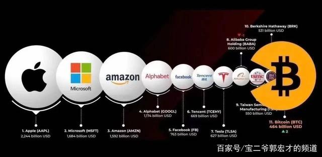
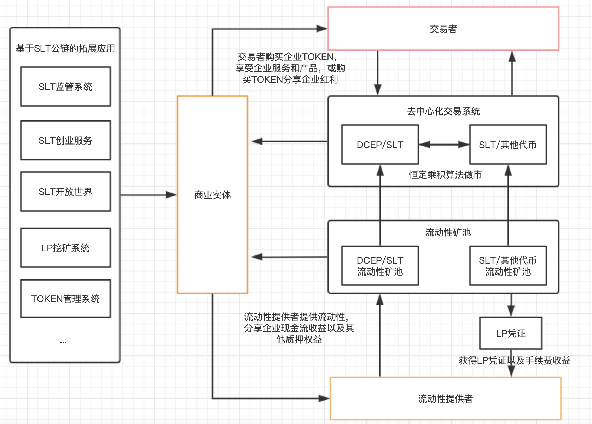
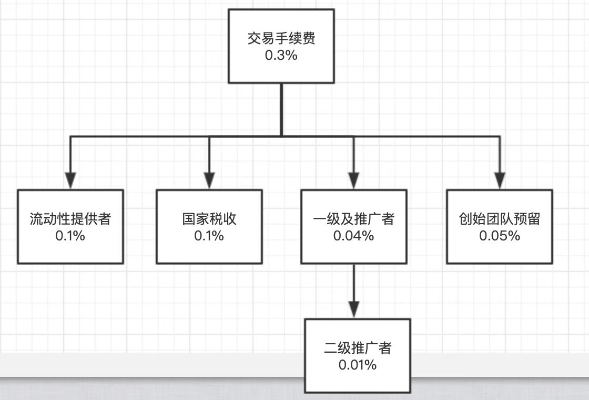
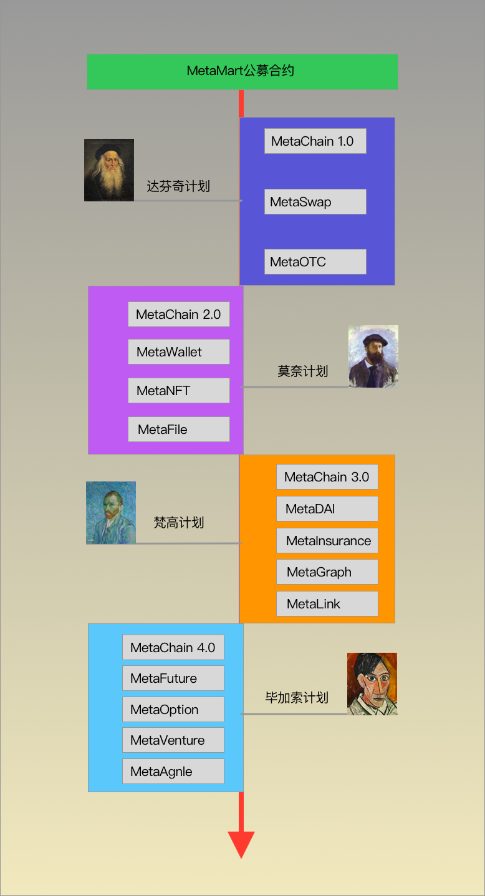

MetaMart whitepaper
===================
🦣 孟码：为商业实体提供区块链金融服务的链上交易市场
===================

# 前言
```

基于可信共识进行权益重新分配带来的自组织效率优化将必然带来社会的改良运动。  

He who receives an idea from me, receives instruction himself without lessening mine; 
as he who lights his taper at mine, receives light without darkening me.

我将思想传授他人，他人之所得，无损于我之所有，犹如一人以我之烛火点烛，光亮与他同在，我亦不因此身处黑暗。  

                                                        《致艾萨克•麦弗逊的信》托马斯•杰斐逊  
```

随着区块链技术的诞生，货币作为股权和债权的最终表现形式发生了根本上的改变一一通证，代表着未来数字化资产的货币横空出世，划时代的数字化特性和分布式存储技术，使得持有者天然成为商业实体的股东。区块链技术日益突飞猛进，但可惜的是当下区块链经济体系仍处于早期草莽阶段，很多区块链项目虽知晓身后除了进步别无他物，却仍旧只剩眼前逐利。尽管如此 MetaMart 依然相信，基于可信共识的权益分配方式带来自组织效率优化，作为区块链经济体系的思想基石，将影响到千行百业，必然带来社会的改良运动，导致社会方方面面发生巨大变化。  

# 目录
* [前言](#前言)
* [目录](#目录)
* [一、 行业前景分析](#一-行业前景分析)
* [1.1 简述](#11-简述)
* [1.2 政策支持](#12-政策支持)
* [1.3 行业问题](#13-行业问题)
	* [1.3.1 低信任的经济社会](#131-低信任的经济社会)
	* [1.3.2 实体结合的种种困难](#132-实体结合的种种困难)
	* [1.3.3 泡沫破灭的时有发生](#133-泡沫破灭的时有发生)
* [二、 MetaMart 设计理念](#二-MetaMart-设计理念)
* [2.1 MetaMart 概述](#21-MetaMart-概述)
* [2.2 MetaMart 定位](#22-MetaMart-定位)
* [2.3 MetaMart 愿景](#23-MetaMart-愿景)
* [三、 MetaMart 项目介绍](#三-MetaMart-项目介绍)
* [3.1 生态系统](#31-生态系统)
* [3.2 资金和服务入口 MetaWallet](#32-资金和服务入口-MetaWallet)
	* [3.2.1 MetaWallet 简介](#321-MetaWallet-简介)
	* [3.2.2 MetaWallet 特点](#322-MetaWallet-特点)
	* [3.2.3 MetaWallet 案例](#323-MetaWallet-案例)
* [3.3 去中心化交易系统 MetaSwap](#33-去中心化交易系统-MetaSwap)
	* [3.3.1 MetaSwap 简介](#331-MetaSwap-简介)
	* [3.3.1 MetaSwap 案例](#331-MetaSwap-案例)
* [3.4 流动性池 MetaPool](#34-流动性池-MetaPool)
	* [3.4.1 MetaPool 简介](#341-MetaPool-简介)
	* [3.4.2 MetaPool 特点](#342-MetaPool-特点)
	* [3.4.3 MetaPool 案例](#343-MetaPool-案例)
* [四、 MetaMart 经济模型](#四-MetaMart-经济模型)
* [4.1 MB 通证设计](#41-MB-通证设计)
* [4.2 MB 通证发行](#42-MB-通证发行)
* [4.3 MB 通证激励模型](#43-MB-通证激励模型)
* [五、 MetaMart 技术架构](#五-MetaMart-技术架构)
* [5.1 技术理念](#51-技术理念)
* [5.2 MetaSwap 交易所](#52-MetaSwap-交易所)
	* [5.2.1 MetaPool 资金池](#521-MetaPool-资金池)
	* [5.2.2 MetaSwap 运转机制](#522-MetaSwap-运转机制)
	* [5.2.3 Fee 手续费](#523-Fee-手续费)
* [5.3 MetaWallet 钱包](#53-MetaWallet-钱包)
	* [5.3.1 Wallet 模块](#531-Wallet-模块)
	* [5.3.2 OTC 模块](#532-OTC-模块)
	* [5.3.3 Meta 模块](#533-Meta-模块)
	* [5.3.4 Mart 模块](#534-Mart-模块)
* [5.4 MetaChain 公链](#54-MetaChain-公链)
	* [5.4.1 MetaChain 1.0 达芬奇](#541-MetaChain-10-达芬奇)
	* [5.4.2 MetaChain 2.0 莫奈](#542-MetaChain-20-莫奈)
	* [5.4.3 MetaChain 3.0 梵高](#543-MetaChain-30-梵高)
	* [5.4.4 MetaChain 4.0 毕加索](#544-MetaChain-40-毕加索)
* [5.5 MiddleService 中间服务](#55-MiddleService-中间服务)
* [5.6 MetaFinance 金融](#56-MetaFinance-金融)
* [六、 发展规划](#六-发展规划)
* [6.1 技术路线](#61-技术路线)
	* [6.1.1 第一阶段：达芬奇计划](#611-第一阶段：达芬奇计划)
	* [6.2.1 第二阶段：莫奈计划](#621-第二阶段：莫奈计划)
	* [6.3.1 第三阶段：梵高计划](#631-第三阶段：梵高计划)
	* [6.4.1 第四阶段：毕加索计划](#641-第四阶段：毕加索计划)
* [6.2 市场规划](#62-市场规划)
* [七、 产品预览](#七-产品预览)


#    一、 行业前景分析
## 1.1 简述

近年来中国区块链产业蓬勃发展，企业数量不断增加，应用落地多点开花，涵盖了包括贸易物流、文娱、社会公共服务、金融、政务、知识产权、社交、日常消费、工业、农业、能源等多个垂直行业。  

根据公开数据统计，2020年，中国2020年总共落地区块链项目数达194个，同比增加102.8%。各地纷纷布局区块链新基建，基础设施不断完善，行业生态不断健全。  从全年融资轮次整体分布情况看，区块链仍处于发展早期阶段，投融资以初期轮次为主，机构对其虽有看好，但仍在观望阶段。战略投资仍旧占据主导地位，全年共有战略投资229起，占总融资数量的50%，种子/天使轮融资以101起次之，A轮融资占比在8月后有逐步增加。  

2021年是区块链快速发展之年，随着 BTC 价格突破60000美金超过全球最大的金融服务提供商Visa的市值，以太坊价格一度突破3400美元，市值超越万事达卡和英伟达逼近沃尔玛，未来这个行业将得到越来越多的关注。



## 1.2 政策支持

在中国近期的十四五规划中，区块链首次被纳入中国国家五年规划，成为发展数字经济和建设数字中国的重要载体，这标志着区块链技术的集成应用将在数字产业化和产业数字化过程中发挥愈发关键的作用，并将促进数字技术与实体经济深度融合，赋能传统产业转型升级，催生新产业新业态新模式，壮大经济发展新引擎。  

“十四五”将是数字经济大发展大繁荣的五年，也会是区块链创新加速、构建生态、广泛落地、纳入监管的五年。《十四五规划纲要》明确了技术创新、平台创新、应用创新、监管创新这四大区块链创新方向，将进一步加快数字中国的建设步伐，助推社会主义现代化建设。  

## 1.3 行业问题

### 1.3.1 低信任的经济社会

如果回到20年前，马云在说“互联网+”的时候，很多企业肯定会非常茫然，因为当时没有一个可以参考的样本，突然的互联网转型，使得实体行业忿然拒绝也是常理之中。当下”区块链+“还处在非常早的时期，正处在当年的“互联网+”一样。

”互联网+“的出现降低了商业实体的获客成本、缩短了产业链条、降低了消费者的时间成本、提高了效率，但是卖衣服的还是卖衣服，卖食品的还是卖食品的，只是换了一种方式做生意，其本质没有改变。在2015年，中国国务院颁布了关于《积极推进““互联网+””行动的指导意见》，中国在随后5年“互联网+”发展迅猛，以淘宝，美团，嘀嘀打车为首的各大互联网巨头相续涌出，通过互联网大大赋能了实体产业，提升了传统企业的效率，降低用户衣食住行的时间成本，同时也瓜分了传统企业的利润，借助帮助传统企业进行互联网转型的理由，实则对传统企业进行或多或少的剥削，这也是在这些互联网企业形成一定规模并“垄断”后，用户的消费成本迅速增加，在目前“互联网+”的转型遇到瓶颈期后，传统企业急需能够进行转型的利器。 

“互联网+”通过整合资源达到效率最大化就达到了如此成就，”区块链+“则是解决信任问题达到效率最大化并将带来更高的成就。 传统经济生活中，民众习惯于信任政府，信任大公司，但现实中很多小事是因为信任问题没有解决而导致效率低下。  

### 1.3.2 实体结合的种种困难

很多企业进行区块链结合的时候，没有仔细想过区块链到底带来了什么，盲目的发币，发链等，这些都没有挖掘区块链的最大价值，MetaMart称之为落地困难。因为这种思路无法让区块链的功能和作用得到发挥。这同样是区块链的发展之所以会如此缓慢的主要原因。  

事实上，在区块链时代，需要更多关注的是个体。特别是要关注个体之间对接方式的改变以及基于个体的新信任机制的建立。当区块链真正关注个体的时候，特别是真正离开中心，能够建立起个体与个体之间的信任机制的时候，一种全新的商业运行逻辑，才能真正形成。  

### 1.3.3 泡沫破灭的时有发生

区块链的匿名性、安全性、不可篡改等诸多特性，经常被一些不法分子非法利用，如：加密世界第一资金盘 PlusToken ，通过区块链的技术，利用用户的贪婪创造一个泡沫破裂的游戏，涉案资金200多亿 ，类似这样的资金盘在2017-2021年断断续续出现在区块链生活中，导致很多大众一听到区块链就望而生畏，就直接和资金盘画上了等号。

# 二、 MetaMart 设计理念

## 2.1 MetaMart 概述

传统金融无法高效的服务于中小型企业，MetaMart 的使命是用区块链技术，以流动性资金池为载体，帮助中小型企业解决早期融资难题、提高融资效率。MetaMart 将建立一个基于区块链的底层金融基础设施，在不改变现有金融框架的基础下，提供更高效、更安全、更透明、更高效、可追溯、可监管的金融基础设施服务。

MetaMart 可以帮助企业拓展融资渠、获得早期资金支持，从传统的银行和证券市场融资转向直接面向消费者和普通用户融资。用户可以更早的参与企业成长，为企业承担风险的同时共享企业成长收益，更早挖掘有价值的企业，让有价值的企业更好的成长。募集资金从传统的融资方管理，转变成流动性池管理，可以分散风险并隔离风险。募集资金保存在智能合约中，公开，透明，安全、可追溯，并且便于国家监管。可以实现跨商家的价值流通，便于商业实体分配利益、激励生态伙伴、提升企业的效益。  

## 2.2 MetaMart 定位

MetaMart 的定位是将用区块链技术将商业实体的商业行为上链，并提供去中心化金融服务。MetaMart 立志于做世界最好的专注于服务商业实体的区块链金融服务公司。 

## 2.3 MetaMart 愿景

MetaMart 的愿景是用区块链技术提高生产力，优化生产关系，构建面向未来数字世界的经济利益共同体和人类命运共同体。

# 三、 MetaMart 项目介绍

MetaMart 定位为一款去中心化金融工具，利用 Token 的通证经济解决价值传递和利益分配问题，用流动性池解决资金安全透明高效以及交易问题，利用智能合约解决信任问题等。MetaMart 将现有的金融体系通过区块链进行升级，并更好的与实体经济相结合，同时解决投资收益与风险平衡、融资便利与高效、生态合作效率提高等诸多问题，在拥抱监管的框架下，提高企业的经营效率，实现企业的高速发展。  

## 3.1 生态系统
    


在产品形态上，MetaMart着重于提供多种API接口的方式，为现有的互联网产品提供基础服务。  

简单而言，即时用层次模型去发行企业通证让企业创造的价值数字化，并用DEX的方式进行交换，同时创建的基于企业的流动性池具有非常好的风险隔离的同时，大大提高价值交换的效率。能加速企业的快速发展，人心合一。  

MetaMart把整个生态系统分为3大类来进行介绍，它们是 MetaWallet 区块链资金和服务入口系统，MetaSwap 去中心化交易系统，以及流动性池系统。下面将用案例进行说明。  

## 3.2 资金和服务入口 MetaWallet
 
### 3.2.1 MetaWallet 简介

MetaMart 将 Token 打造成企业的股权、债权以及商品或服务的交易通证，并通过区块链去传导。（通过审核备案后的企业可以自由发行 Token ）  

MetaMart 采用  MB + XT 的 Token 组合， MB 是 MetaMart 的通用通证，实体商业将在 MetaChain 上自行发行属于自己的通证 XT ，组成 XT/ MB 的多种交易对，通过  MB 在一定意义上实现商业通证的价值传递，在 MetaWallet 钱包里允许商业机构自由分配通证以及通过智能合约设置属于自己的通证规则，MetaMart 也将基于 MetaChain 开发多种基础应用服务，给实体商业带来优质的金融工具。  

MetaMart 也将基于 MB 公链开发多种基础应用服务给实体商业带来优质的金融工具，同时，分散性的Token 可以降低整体金融风险。  
    
### 3.2.2 MetaWallet 特点

- 提升企业效率：  
合理的利润分配是企业提高效率的方式之一，传统企业的利润分配仅仅是工资+提成，甚至很多岗位只是”死工资“，这大大影响了员工的积极性，而提成并不能全面覆盖所有岗位，所以传统方式有，期权，股票，但是这都建立在企业上市的前提下，对中小型企业非常的不友好，那么如果企业发行属于自己的通证，将通证分配给员工，消费者，上下游，使其利益与所有参与者捆绑在一起，那么即可实现效率的最大化。  

- 解决企业前期资金问题：  
企业初期往往伴随着资金问题，同时作为消费者也无法享受企业早起红利，基于此，MetaMart的Token就可以作为早起企业融资的工具，并且为了降低企业在前期融资的困难，MetaMart通过流动性池解决信任问题，用户通过将资产注入一个链上智能合约中，企业注入通证，因通证自带金融属性（价格会随着市场波动），企业仅需对将自己的产品和服务与Token挂钩，则可时间价值的赋能。伴随着价格的升高，早起投资者可获得高额回报或享受更多产品和服务，若价格下降，在保障产品和服务的基础上，智能合约还能赎回部分资产，确保风险都在可控范围内。  

### 3.2.3 MetaWallet 案例

智己汽车发行3亿枚原石，用户不停的使用智己汽车的同时就不断在开采原石。3亿枚原石等于4.9%的公司股份，原始价格在1.6元左右，这相当于将企业的发展红利分给早期支持企业的个体用户，实现利益的捆绑。  

## 3.3 去中心化交易系统 MetaSwap

### 3.3.1 MetaSwap 简介

自比特币诞生以来 ，已有超过 5，000 种加密货币相继问世。目前加密货币总 市值已超过 2640 亿美元 ，且其日交易量已经高达 1140 亿美元 。为了给加 密货币交易者提供更便捷的服务，各区块链加密货币交易平台也相继成立。然 而，绝大部分交易平台是中心化的，并且代为管理用户的私钥。这就使得用户的 私钥及其对应资产完全受控于中心化的交易平台。这非但极其不安全，且违背 了区块链技术去中心化金融思想的初衷。  

去中心化交易平台 (DEX) 的出现解决了这个问题。任意用户均可在去中心 化的交易平台上面购买和出售加密资产而无需信任任何一个中心化的实体。在 2019 年，共有超过 250 个去中心化交易平台问世。他们的年交易量达到了约 24 亿美元 。目前中心化的交易平台日交易量可以高达五百亿美元 ，所以相对而言去中心化交易平台还只停留在起步阶段，未来还有非常大的发展空间。  

MetaSwap 作为 MetaMartChain 上的一个核心应用，承载所有的交易流转，与传统的中心化交易所不同的是，MetaSwap 采用流动性池作为交易基础，将传统交易所的人与人的撮合交易转变为人与资金池的交易，所有交易以及质押都通过区块链的形式保存在链上。公开透明。

总而言之，企业可以在发展初期拿出部分通证换取用户的资金，获得发展，同时对于用户而言，用多余的资本“投资”自己看好的项目/企业，从而获得更好的回报，企业发行的通证还可以直接用于购买产品和服务，持有通证的用户其利益无形的与企业捆绑在一起，通证经济将投资者/消费者/生产者的身份打通，旨在让用户挖掘更具价值的企业，同时也解决优质的初创公司早起资金问题。

同时，MetaMart在风险把控这块也做了对应的措施，通过链上智能合约保护资产的同时，允许商家设置黑洞交易门槛，将通证价值锁定在流动性池中，当出现风险时，用户持有的通证价值不会归零，会按照流动性池内的资金进行等比兑付，从而在保护用户资产同时，降低整体金融风险。

### 3.3.1 MetaSwap 案例

案例：王女士看好一家超市，超市在前期融资过程成遇到问题，于是通过MetaMart发行Token，企业将部分 Token 放入流动性池中，同时公布自己的产品服务方案如：一枚 Token 可以当作本小店5元DCEP使用，若持有100枚，则支付时可享受9折优惠，若持有500枚可以享受8折优惠的同时每天可以领一瓶牛奶。因其释放的 Token 有限，切企业承诺一枚Token可以当5元使用，且供需关系会改变价格，那么作为用户，可以通过流动性池直接来进行购买，也可以用通证直接进行商品交换，甚至可以一直持有通证，享受小店价值升值带来的长期红利。

## 3.4 流动性池 MetaPool

### 3.4.1 MetaPool 简介

流动性池可以是一个由代码托管的资金池，将人与人的撮合交易转变为人与资金池的即时交易，流动性池具有安全，公开，透明，不可篡改等诸多特点，MetaMart将最重要的资金交易以及资金质押交给流动性池。

MetaMart 独创的双重流动性池能很好的解决企业在初创期融资问题，以及一定程度上对于投资者资金的保护，企业将创造的 Token (用 X-Token 表示，简写 XT ） 放入初创池中，用户可将DCEP 或  MB 放入池内，形成的XT/ MB 的交易对，为流动性池提供流动性的同时，提供者可以分享基于该池产生的交易手续费收益。

因初创池的特殊性，企业在早期可以通过卖出自己的 Token 来获得池内资金（向流动性池中卖出X），这个环节 MetaMart 称之为早期资金，MetaMart 设置了40%（初始值）的门槛，即企业获得的资金不能超过总资金池的金额，对于早期提供流动性的用户，企业可以给予基于提供流动性的凭证（LP-Token）的挖矿收益，该收益可以是  MB 也可以是 XT，（为了鼓励早期支持者，建议企业对于初创池设置的LP 奖励高于流动池），同时为了保障投资者资金，提供流动性的投资者可以任意时间撤出池内资金（最多损失40%）。这也是激励企业为早期投资者提供更周到的服务。  

### 3.4.2 MetaPool 特点

- 提供交易深度和流动性：流动性池的一大特点及时为该交易提供交易深度和流动性，因为MetaMart不是股票市场，企业Token初期缺乏交易深度和流动性，导致用户想卖卖不出，想买买不进，通过为该流动性池注入1:1的资产后，即可进行实时交易。

- 全新的投资模式：传统模式包括证券市场，大多数用户只能通过低买高卖的方式赚取差价，而流动性池可以让你赚取企业交易流水的手续费（原本应该是交易所赚的钱），并打造一种全新的消费模式，即质押消费：用户不花费1分钱，仅通过质押Token提供流动性便可以获得该Token交易的流水分红。

- 安全质押池：去中心化的智能合约帮你管理你的资产，你的资产仅能通过你的私钥进行导出，可以围绕此打造一种基于流动性池的全新质押模式，将原本第三方控制权交给代码，大大降低风险以及解决信任问题。

- 风险隔离：MetaMart 每组交易对都时相互隔离的，如果其中某企业通证产生风险时，并不会影响到整体。可使得整个系统

### 3.4.3 MetaPool 案例

小王非常看好一家刚开的饭店，饭店开通了 Token，并且有流动性池奖励，小王购买了饭店的Token 并且通过1:1进行质押提供流动性后，依照商家设置的流动性 LP 奖励，小王每天获得了商家的 Token，小王可以直接拿 Token 去该饭店消费，也可以将 Token 卖掉变现。（卖出时，会收到币价波动而导致的盈亏，可以设置能承受的最大损失）

# 四、 MetaMart 经济模型


# 4.1 MB 通证设计

由于目前整个区块链与实体金融没有一个完善的体系融合，所以MetaMart设计了  MB ，一方便便于商业实体之间的价值流转，另一方面通过区块链技术大大提高资金安全，实现企业效率的快速提升。

另一方面考虑到为来整个中国乃至全球金融格局， MB 仅在当前经济环境下，为了更好的建设区块链金融体系而生，当区块链金融体系搭建完成即时定位完成，MetaMart将会把所有 MB 转变为等值的DCEP。

# 4.2 MB 通证发行

MetaMart 总共发行1亿枚，其中10%即10亿枚用于创始团队持有，用于产品研发以及团队扩展，2%用于早期融资，给予早期信任MetaMart的伙伴，剩余88%将致敬BTC，全部用于提供流动性的奖励以及自然出块，并在2140年全部释放完成。  

- 团队持有：为了保障整个项目可持续性发展，1000万枚代币也一起与2140年释放完成;  
- 私募融资：2%的私募代币将通过流动性池完成，私募的代币将按照私募金额占比进行为期3年的持续性产出;  
- 流动性池：MetaMart 拿出 30% 即 3000 万枚用于奖励流动性提供者，并设置不少于5%的激励;  
- 自然出块：在中期为了整个生态的基础算力建设，MetaMart 将拿出58%的代币用于激励算力提供者。  

# 4.3 MB 通证激励模型

MetaMart坚信价值的最大价值在于创造价值。而区块链价值来源于用户的共识，所以对于 MB 而言， MB 的最大价值在于创造基于METACHIAN生态的各种通证，并且通过流动性池保持安全交易，每一个企业生成的通证即是该企业的总”价值“， MB 即是所有企业”价值“之和，能使所有持有 MB 的人享受红利，整个激励模型，流动性池作为 MetaMart 资金交易的支持者和保护者，MetaMart 在智能合约中，会收取基于交易双方的0.3%手续费。MetaMart将0.3%手续费用于各种激励,其中：

- 0.1%用于未来国家收税服务  
国家税务：当DCEP成为主要支付手段后，MetaMart将提供基于流动性的税收服务，会根据每个流动性池不同的属性以及流动大小/市值等进行分类，提供给国家较可观的数据支持

- 0.1%用于对流动性提供者服务  
流动性提供者：为了确保企业能够获得足够的交易深度和流动性，MetaMart将基于企业自身的流动性池设置0%-0.1%一个可以调节的手续费奖励。

- 0.5%用于早期推广者  
早期推广者：MetaMart将前期0.5%用于奖励给那些早期为MetaMart拓展市场的推广者，当一个推广者成功推广一个企业后，会基于其创建的流动性池进行手续费抽成，推广的越多，流动性池越大，交易越频繁，则获得的收益越高。

- 0.5%用于保留  
保留池：保留0.5%用于未来的激励。

# 五、 MetaMart 技术架构

MetaMart 技术核心架构以 MetaSwap, MetaWallet, MetaChain 为基础，MetaFinace 为衍生，打造一系列的产品和开放的生态体系为目标。


## 5.1 技术理念

MetaMart 信仰市场的力量，尊重生态参与者的意愿，上层应用 MetaSwap 保持开放可定制的原则，提供便利的API和可配置的参数，供商业实体根据自己的需要调整商业规则；流量入口 MetaWallet 以安全隐私为基本原则，非必要并保存用户的隐私数据，；底层公链 MetaChain 以符合监管下的社区共识为基础原则，随着应用推广、市场扩大、MetaMart自身的成长，将根据市场需要选择各阶段最佳的共识机制；MetaFinance 则是以自由灵活的可组合为基本原则，设计去中心化金融产品，不仅可以和MetaMart体系内部的其他金融产品组合，还可以和第三方DEFI项目便利的组合拼接，搭建DEFI领域的乐高世界。

## 5.2 MetaSwap 交易所

MetaSwap 是一个去中心化的交易系统， 为商业实体提供去中心化的流动性池管理工具，为用户提供通证交易的场所，流动性池管理是MetaSwap最核心的系统。  


### 5.2.1 MetaPool 资金池

MetaSwap 交易系统有两种资金池：流动性池，储备金池。

- Liquidity Pool 流动性池  

流动性池是 AMM 的主要资金库， AMM( Automated Market Maker ) 即交易系统采用的自动做市商模式，商业实体、交易者、消费者通过去中心话的区块链钱包直接与流动性池交互，买卖通证、提供流动性及各种挖矿；

MetaSwap 通过流动池为任意资产对提供流动性。对于任意一堆数字资产 (A， B ∈ T )，MetaSwap去中心化交易所的的储备金存储都遵照以下的线性关系N At · N Bt = K， 其中K是常数。流动性提供者根据线性关系，将自己的代币投入到流动池中，即对于每个要存入的代币A，流动性提供者还需要根据定义的关系将一些代币B放入池中。 交易者可以交换 MetaSwap 中可用的任何资产对。资产交换可以通过智能交易合约无缝完成并且没有确认延迟。设nA为交易者想要用于购买代币 B 的代币 A 的数量，f 为交易所产生的交易手续费，交易者将获得 nB 个代币 B，如下列公式所述：


- Reserve Pool 储备金池  
储备金池是存放风险保障和保底储备的资金保险柜，MetaSwap 为了保障用户的基础权益，设计了特殊的储备金池机制，在通证价格低于储备释放价时，将触发锁定流动性池和储备金池，由社区治理投票决定是再次开放流通还是启动清盘。启动清盘时，将动用储备金池中的资金，为清盘提供资金保障。

### 5.2.2 MetaSwap 运转机制

MetaSwap 的运转过程如下：

- 1.创建储备金池和流动性池  
    - 商家先创建储备金池：将DCEP放入储备金池，设置储备金池的容量（总数量和劣后价格）  
    - 商家发行ERC20代币  
    - 商家将代币进行分配：将部分代币放入流动性池，提供初始流动性  
    - 用户可以买卖代币  

    - 用户可以添加流动性到流动性池
        * 流动性池可以随存随取
        * 可以获取流动性奖励
        * 可以获得LP-token
        * 然后挖矿可以获得不同服务（包括会员等级，折扣，优惠券）

- 2.补充储备金池  
    - 商家可以自己二次添加更多资金到储备金池
        提升用户信心，可以拉升 MT 的价格
        提高资产净值，降低市净率，吸引用户购买

    - 用户也可以添加更多资金到储备金池
        储备金池的收益会比流动性池高很多
        储备金池正常无法取出，只有在黑铁时期，触发劣后机制启动时
        
        用户帮助商家添加储备金，有利于商家回收成本，相当于商家可以进行二次融资

- 3.流动性池作用  
    - LP 可以获得手续费
    - 帮助商家锁定流通中的 MT
        使市值更高
    - 流动性池作为商家营销手段的基础
      以 LP-Token数量作为会员等级，设计营销活动、锁仓、VIP服务
    - 商家可以优先将股权出售给 LP 


- 4.退出流动性池  
    - 可以随时退出  
    - 可能会有损失  
        包括无常损失、滑点损失、币价波动带来的本金损失  
    - 会员等级的正常衰退机制  
        即用户移除流动性后，会员等级不会马上失效，而是根据不同级别有不同的衰退速率  

    - 会员等级可以通过NFT铸造变成永久的会员  
        即用户移除流动性后，如果希望保留会员身份，可以通过提供一定资金，将会员身份铸成NFT永久保留  
        NFT身份可以出售转让。  

- 5.退出储备金池  
    - 商家和用户都可以销毁自己提供的储备金，对应的 MT 数量销毁，并获得法币 

### 5.2.3 Fee 手续费



## 5.3 MetaWallet 钱包

MetaWallet 是为 MetaMart 专业定制的区块链钱包，承载所有 MetaMart 的功能，是所有 MetaMart 系列产品的流量入口。用户包括投资者、消费者、生产者也可以通过第三方钱包如 MetaMask、Imtoken 等直接与 MetaMart 交互，不过第三方钱包提供的功能较少，不能及时更新 MetaMart 推出的新功能，体验非常受限。MetaWallet 除了区块链标准钱包模块 Wallet 以外，还将提供 OTC、Meta、Mart 功能，其中 OTC 支持法币购买资产或商品，Meta对接各种 DEFI 产品供提供偏投资属性的功能，Mart 提供商品买卖、会员管理等偏消费属性的功能，下面详细介绍。  

### 5.3.1 Wallet 模块

Wallet 是标准的区块链钱包模块，用户可以创建全新的钱包，也可以通过助记词、私钥导入的方式恢复钱包。钱包初期支持与以太坊 EVM 兼容的多链，包括 Ethereum、BSC、Heco、Solana 等。  

MetaMart 充分尊重用户隐私，非必要不记录用户的任何信息。助记词等敏感信息都只保留在客户端本地，任何条件下都不会上传到服务器。交易历史记录等，默认也只保留本地，如果用户打开云同步开关，可以选择性的将各条链的交易历史记录分别上传到云端，使得用户在多个客户端上同步使用。钱包还将提供交易通知功能、限额管理功能、小额无密码支付功能，这些高级功能默认都是不开启的。  

最后，在标准区块链钱包功能基础上，MetaWallet还将开发区块链社区治理功能，包括投票、多签名、Layer2的拼交易等功能，拼交易是指借助Layer2技术帮助多个用户凑齐一批交易然后一次性发送给节点打包节省手续费。  

### 5.3.2 OTC 模块

OTC 模块提供场外交易功能，设计目标是以最佳的体验，帮助用户使用法币购买代币，鼓励用户用代币支付商品购买费用或者投资 DEFI 产品。MetaMart 将使用不同于中心化交易所 OTC 的特别设计机制，帮助区块链的产品出圈，使得更多用户接受区块链的流动性池、Token、NFT和去中心化思想。  

### 5.3.3 Meta 模块

Meta 模块提供乐高积木一样的去中心化金融产品交易功能，设计初始目标是作为 MetaSwap 的入口，然后以此为基础，扩展功能，使得钱包支持更多 Meta 系列的 DEFI 产品，也支持使用第三方的 DEFI 产品，比如第三方DEX（ Uniswap、SushiSwap等）、第三方借贷（Compound、AAVE等）。 Meta的长远目标是成为一个通用的去中心化世界的浏览器，借助它，用户可以到达任何区块链产品，包括浏览、搜索、使用各层面的数据和产品，包括chain、token、block、transaction、contract、dapp、file。  

### 5.3.4 Mart 模块

Mart 模块是和商业实体发生关系的场所，承载着MetaMart打造区块链世界的Meituan、Disney、Wal-Mart的梦想。Mart模块首先支持购买无需物流配送的服务，采用社交团购模式分发商业实体的服务，所以第一期功能是实现社交分享、团购折扣、会员优惠等功能；然后将支持线上文化娱乐功能，支持短视频、直播快照功能，承载电商平台模式的NFT生成、买卖、竞拍等功能；最后将支持购买实物商品的传统电商功能，打造研发、设计、生产、销售、消费、粉丝社群营销的闭环，推广区块链行业的DAO协作模式，助力发现、帮助具有创新精神快速成长中的实体商业。  

## 5.4 MetaChain 公链

长远看，MetaMart 的目标市场、用户体量、商品交易、投资交易等对公链的性能要求都非常高，所以 MetaMart 底层最终将采用自研公链，不过是随着 MetaMart 的成长和发展分阶段进行的，即 MetaChain 0.1、1.0、2.0、3.0共四个阶段，每一个阶段的目标各有侧重，但都是满足各阶段的 MetaMart 的发展需要。  

### 5.4.1 MetaChain 1.0 达芬奇

MetaChain 0.1 并不是真正的公链，或者可以称为虚拟公链，技术核心是基于 Universal EVM Interface 的通用接口，底层可以对接所有与以太坊 EVM 兼容的公链，未来自研的 MetaChain 1.0、2.0、3.0 也都将采用兼容 EVM 的技术方案，接入 Universal EVM Interface 的体系，所以 MetaMart 的上层应用可以从第三方公链上无缝迁移到自研公链上。  

Universal EVM Interface 的有两个核心的子模块，一个是类 [The Graph](https://thegraph.com/) 和 [Covalent](https://www.covalenthq.com/) 的链上数据通用查询的 API 模块， 一个是签名后的数据代理转发到区块链节点的模块。  

### 5.4.2 MetaChain 2.0 莫奈

MetaChain 1.0 将 Fork 以太坊 1.0 并将根据业务模式进行小规模修改，采用根据 POW 修改的 MPOW（Meta Proof Of Work） 共识机制出块。  

MPOW 共识的核心思想是，鼓励商业实体运营节点，矿工应该优先为有价值的流动性池中的交易进行打包，鼓励矿工将新挖出来的数字货币为有价值的流动性池中提供流动性满足该流动性池的增长需求。  

具体过程是：参与挖矿的节点必需先为一个流动性池提供流动性，并将接收矿工奖励的钱包地址和该流动性池预先绑定，优先为该流动性的交易提供交易打包服务，采用工作量证明机制出块，但最终得到的区块奖励总金额是根据该流动性池的 TVL（Total Vaule Locked 锁仓总量）来动态调节的；多个节点可以竞争为同一个流动性池打包，出块的节点可以得到该区块奖励总金额的 90%，其他绑定该流动性池的打包节点按照自身持有的 LP-token 份额进行排名，前10名（如果不足10名则按实际绑定的节点数量）均分剩余 10% 该区块奖励。  

### 5.4.3 MetaChain 3.0 梵高

MetaChain 2.0 将 Fork 以太坊 2.0 为基础进行小规模修改，采用根据 POS 修改的 DPOL(Delegate Proof Of Liquidity) 共识机制出块。  

POL 共识的核心思想是，随着市场发展，交易需求的增长，MPOW 共识下的 TPS 很难满足市场的需求，需要通过适度降低参与挖矿的节点数量来提升性能，并鼓励成长起来的商业实体运营节点。  

具体过程是：参与挖矿的节点必需先为一个流动性池提供流动性，并将接收矿工奖励的钱包地址和该流动性池预先绑定，根据挖矿节点接收到的委托代理的 delegate locked value 来决定出块的概率，即流动性池越大、接收到的委托代理的锁仓量投票比例越高，则出块概率越高，得到区块奖励总金额越高，区块奖励直接投入到锁仓池智能合约中，用户可以随时从锁仓池中取出自己的份额。普通用户可以将自己的LP-token质押委托给节点，以虚拟的形式参与硬挖矿。  

### 5.4.4 MetaChain 4.0 毕加索

MetaChain 3.0 的目标是进一步提升性能，也是为满足政府监管需要，需要降低区块链节点的数量，提升节点之间的网络通讯效率，核心是建立数个云计算中心来组建挖矿池，淘汰独立的中小挖矿节点,将采用 POC( Cloud Proof Of Liquidity) 共识机制出块。

具体过程是: 参与挖矿的分节点必需采用云计算中心提供的服务器作为矿机，然后为一个流动性池提供流动性，并将接收矿工奖励的钱包地址和该流动性池预先绑定，并将接收到的委托代理 LP-token 汇总到云计算中心的超级节点，最后超级节点构成节点网络，并根据汇总的Liquidity决定各超级节点的出块概率，区块奖励则由出块的超级节点按自定的规则分配给汇总到自己的分节点，所以分节点只能打包，自身不能出块。

云计算中心数量限制为21个，并将充分考虑到社区代表性和政府监管要求，至少有1个政府节点，1个学术界节点，1个非政府组织节点。

## 5.5 MiddleService 中间服务

MiddleService 中间服务是为商业实体提供更多的区块链金融服务，使得商业实体可以更便捷、更高效、更广泛的接入到 MetaSwap 体系中来。可预见的中间服务包括 MetaNFT 非同质化通证，用于描述商业实体的差异化产品，尤其是粉丝经济中的限量款商品或私人定制商品； MetaFile 去中心化存储，用于为商业实体提供多媒体资源服务，例如产品图片、艺术图片、短视频、直播快照等； MetaLink 预言机用于帮助商业实体将复杂结构的数据或不便于直接上链的数据桥接入区块链，例如商品的法币价格、库存；MetaGraph 数据图则为商业实体提供更高效率的区块链世界数据的API查询服务，比如流动性池中通证的历史价格、会员质押的LP-Token数量等。MiddleService 不仅限于以上列举的服务，随着 MetaSwap 的发展及商业实体的需求变化，将引入更多生态中间服务，为用户提供更好的体验。

## 5.6 MetaFinance 金融

MetaFinance 广义上包括所有 MetaMart 提供的区块链金融服务，狭义上是指除了 MetaSwap IMO 以外的区块链金融服务，包括 MetaDai 区块链商业实体借贷、 MetaInsurance 区块链商业实体保险、MetaDisposal 区块链商业实体不良资产处置、 Meta MetalAngle 区块链商业实体天使融资、 MetaVenture 区块链商业实体风险融资。

商业实体借助 MetaSwap 获取融资，并将投资者、生产者、消费者聚集到同一个流动性池中，每一次商业行为都将为区块链世界带来数据流和资金流，经过时间的积累，将沉淀庞大的有价值的数据宝藏，这些数据都是公开、透明、可信、可追溯的有巨大商业价值的数据，围绕着这些与商业实体资金流紧密相关的数据，可以衍生品类丰富体量巨大的去中心化金融服务，即 MetaFinance，

传统金融中，商业实体借贷的形式是抵押借贷、担保借贷，无论是哪种借贷形式，都需要涉及资产评估、手续繁琐、耗时较长；去中心化金融中的借贷非常活跃，然而借出的资金主要用于 DEFI 领域的其他链上金融，并没有投入到商业实体中，所以对实体经济的发展促进作用有限。MetaDai 将区块链金融中的流动资金投入到商业实体中的经营中，有利于商业实体快速的获取新的资金来源，也有助于区块链世界的产品和资金出圈，带来更稳健、有实体支撑的收益。


# 六、 发展规划

## 6.1 技术路线

MetaMart 技术路线以底层使用公链不同进行分期，各阶段的名称是达芬奇计划、莫奈计划、梵高计划、毕加索计划。MetaMart 开发的各阶段侧重点不同，除了底层公链，比较重要的是达芬奇计划中的 MetaSwap、莫奈计划中的 MetaWallet、梵高计划中的 MetaDai、毕加索计划中的 MetaFuture。同时需要说明的是，MetaSwap 的开发迭代并不仅限在达芬奇时期，在以后的莫奈、梵高、毕加索时期都将不断完善更新。同理，其他系列的产品也将根据市场需要进行更新。



### 6.1.1 第一阶段：达芬奇计划
达芬奇计划的主要目标是 MetaSwap 的正式上线，配套的底层公链 MetaChain 1.0 中的 Universal EVM Interface 及辅助系统 MetaOTC 也将在同一期完成。达芬奇时期的产品功能相对单一，钱包直接以第三方钱包接入即可。

### 6.2.1 第二阶段：莫奈计划
莫奈计划的底层公链 MetaChain2.0 是

莫奈计划的主要目标是 MetaWallet 的上线，子模块 Wallet、Meta、Mart 完善，提供多样化的去中心化金融产品和商业实体商品服务，充分满足投资者和消费者的需求。同时，大力开发MetaNFT, MetaFile 服务，帮助商业实体大量将商品服务和商业行为上链。

### 6.3.1 第三阶段：梵高计划
梵高计划的主要目标是将区块链世界中的数据流、资金流和传统互联网世界进行深度融合，一方面借助 MetaGraph 将链上数据提供便利的API服务，一方面借助 MetaLink 将传统互联网世界中产生的大量数据上链。同时，梵高计划还将提供多样化的去中心化金融服务，包括 MetaDai 和 MetaInsurance。

### 6.4.1 第四阶段：毕加索计划
毕加索计划的主要目标是将 MetaMart 系列及第三方去中心化金融服务打造成可组合的乐高积木，无论是专业投资者还是业余投资者，甚至普通投资者都可以轻松的按照需要自由组合各项服务，大大提高商品购买和投资便利性。

## 6.2 市场规划
总流通市值分阶段目标
# 七、 产品预览
